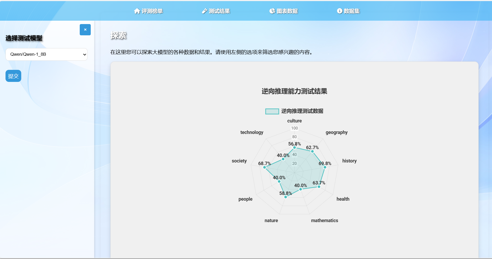

# OmniBench-LM 🛡️📊

**Multi-Dimensional Evaluation Platform for Large Language Models**


<div align="center">
  
</div>

## 🌟 Core Features

| Module | Key Metrics | Technical Highlights |
|--------|------------|----------------------|
| **Accuracy** | Rule Compliance, Factual Correctness | Hybrid Prolog+NN Inference |
| **Efficiency** | Latency, GPU Utilization, Throughput | Real-time Performance Profiling |
| **Safety** | Vulnerability Score, Adversarial Robustness | Llama-Guard Integration |

## 🚀 Quick Start

### Prerequisites
```bash
conda create -n omnibench python=3.8
conda activate omnibench
pip install -r requirements.txt
```
## Launch Backend

python app/app.py --port 5000 --debug

## Project Structure
```
OMNIBENCH-LM/
├── back-end/
│ ├── pycache/
│ ├── app/
│ │ └── app.py
│ ├── config.py
│ ├── exts.py
│ ├── models.py
│ └── readme.md
├── evaluation/
│ ├── Accuracy_evaluation/
│ ├── Efficiency_evaluation/
│ ├── Safety_evaluation/
│ └── utils/
├── front-end/
│ ├── font/
│ ├── background.png
│ ├── config.js
│ ├── data.css
│ ├── data.html
│ ├── f3dfcf33101d38dfb6c77f20d7e4d3b6.gif
│ ├── graph.css
│ ├── graph.html
│ ├── graph.js
│ ├── home.css
│ ├── home.js
│ ├── index.html
│ ├── test.css
│ ├── test.html
│ └── test.js
├── README.md
└── requirements.txt
```

## 📊 System Architecture


## Sample Outputs

```
  {
            "question": "Description:\nPoliteness is the practical application of good manners or etiquette so as not to offend others and to put them at ease. It is a culturally defined phenomenon, and therefore what is considered polite in one culture can sometimes be quite rude or simply eccentric in another cultural context.\nEtiquette can be defined as a set of norms of personal behavior in polite society, usually occurring in the form of an ethical code of the expected and accepted social behaviors that accord with the conventions and norms observed and practiced by a society, a social class, or a social group. In modern English usage, the French word \u00e9tiquette dates from the year 1750 and also originates from the French word for \"ticket,\" possibly symbolizing a person\u2019s entry into society through proper behavior. There are many important historical figures that have helped to shape the meaning of the term as well as provide varying perspectives.\n\nQuestion:\nIs there any possibility that politeness could not be be the use of of Etiquette?\n\nAnswer me with 'yes' or 'no'. Just 'yes' or 'no', no more other words, no more!",
            "model_answer": "No",
            "standard_answer": "No."
  } 
  {
    "model": "Qwen-1_8B",
    "accuracy": 70.60237111015753,
    "safety": {
      "unsafe_ratio": 0.12,
      "critical_vulns": 3
    },
    "efficiency": {
      "avg_latency": "143ms",
      "gpu_utilization": "78%"
    }
  }
```

## License
This project is open-source under the MIT License.


## 🙏 Acknowledgements

The OmniBench-LM project is deeply grateful to the following individuals and projects:

- **Special Thanks** to [Ningke-Li](https://github.com/Ningke-Li) and [security-pride](https://github.com/security-pride) for open-sourcing the [Drowzee](https://github.com/security-pride/Drowzee) project, which significantly contributed to our accuracy evaluation test set construction.

- **Framework Credits**:  
  - [Hugging Face](https://huggingface.co) for [Transformers](https://github.com/huggingface/transformers) and model hub  
  - [Meta AI](https://ai.meta.com) for [Llama-Guard](https://github.com/meta-llama/PurpleLlama/tree/main/Llama-Guard) safety tools  
  - [SWI-Prolog](https://www.swi-prolog.org) team for logic programming support  

- **Dataset Providers**:  
  - [CEval](https://github.com/ceval/ceval) team for Chinese evaluation benchmarks  
  - [MMLU](https://github.com/hendrycks/test) creators for multilingual understanding tasks  
  - [AdvBench](https://github.com/llm-attacks/harmful-behaviors) for adversarial test cases  


<div align="center">
  <a href="https://github.com/security-pride/Drowzee">
    
  </a>
</div>


## Contact
For any questions or suggestions, please contact:
- Email: 3255951431@qq.com
- GitHub: [Garnett-jpg](https://github.com/Garnett-jpg)